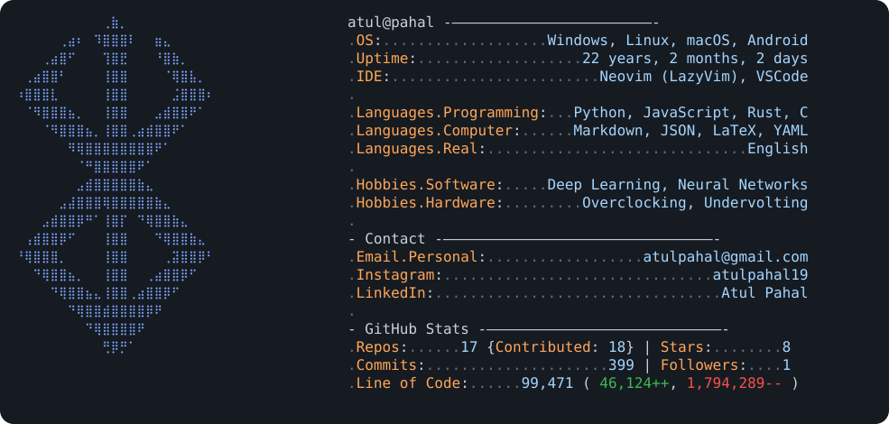

<!-- Automated Live Terminal Stats Card -->

  <picture>
    <source media="(prefers-color-scheme: dark)" srcset="dark_mode.svg">
    <source media="(prefers-color-scheme: light)" srcset="light_mode.svg">
    
  </picture>

 

<h2 align="left">💻 Tech Stack & Tooling</h2>

  <!-- Core Languages -->
  
  
  
  

  <!-- Machine Learning & Frameworks -->
  
  
  

  <!-- Data Ecosystem -->
  
  
  
  

 

<h3 align="left">🔗 Connect With Me</h3>

  
  
  
  

 

### 🎮 Contribution Graph

<picture>
  <source media="(prefers-color-scheme: dark)" srcset="https://raw.githubusercontent.com/AtulPahal/AtulPahal/output/pacman-contribution-graph-dark.svg" />
  <source media="(prefers-color-scheme: light)" srcset="https://raw.githubusercontent.com/AtulPahal/AtulPahal/output/pacman-contribution-graph.svg" />
  
</picture>

---
